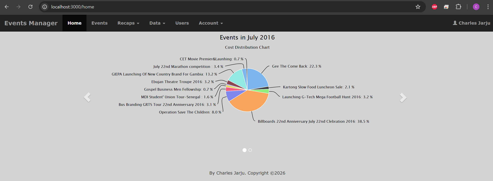
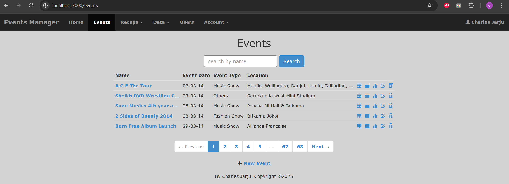
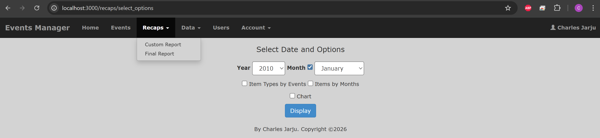
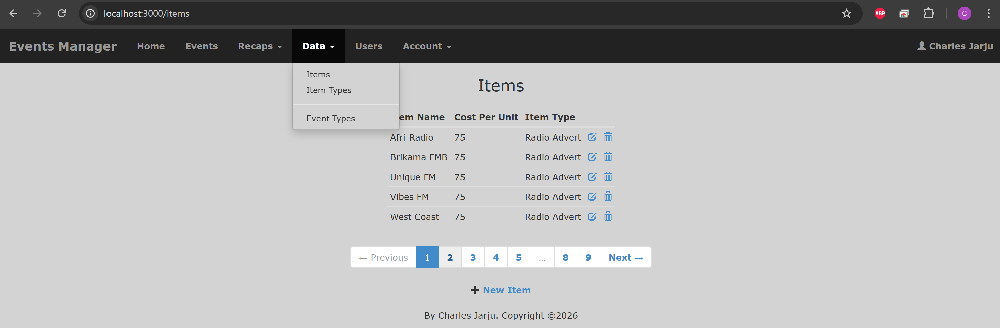
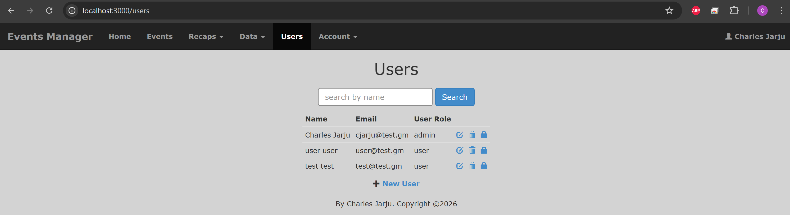
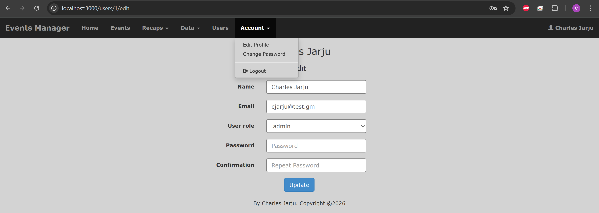

# Event Sponsorship CMS
**Event Sponsorship CMS** is a Ruby on Rails web application for managing events and  sponsorship.

## Demo

A quick look at the application in action.

### Home page
<p align="center">
  
</p>

### Events page
<p align="center">
  
</p>

### Reports page
<p align="center">
  
</p>

### Reference data page
<p align="center">
  
</p>

### Users page
<p align="center">
  
</p>

### Account page
<p align="center">
  
</p>

## About Project
This hobby project is inspired by an in-house application used at my former workplace. They sponsor events as part of their corperate social responsilibities.

The application lets authorized users:

- Create and edit events with categorized costs and item types
- View month-specific dashboards with pie charts for event and item-type expenditure
- Generate specific recap reports and year-end final reports
- Administer reference data - items, item types, event types - and users (**admin only**)
- Manage user accounts and roles (**admin only**)
- Manage account details: profile update, password change

The application is built with Ruby on Rails for robust backend functionality, includes Docker support for containerized deployment, and uses a relational database (PostgreSQL) for data persistence.

## System Dependencies

- [Ruby](https://www.ruby-lang.org/en/) 2.4.x
- [Ruby on Rails](https://rubyonrails.org/) 5.0.x
- [Chartkick](https://rubygems.org/gems/chartkick) 1.2.x
- [will_paginate-Bootstrap](https://github.com/bootstrap-ruby/will_paginate-bootstrap) 1.0.x
- [axlsx_rails](https://rubygems.org/gems/axlsx_rails) 0.5.x
- [PostgreSQL](https://www.postgresql.org/) 9.5+
- [Docker](https://www.docker.com/) + [Docker Compose](https://docs.docker.com/compose/) (if you prefer containerized setup)

## Getting Started

This section contains the steps necessary to get the application up and running.

### Prerequisites

1. Clone the repository:

   ```bash
   git clone <repository-url>
   cd eventmgr1
   ```
2. Environment configuration is handled via `.env`. Copy `.env.example` to `.env`.
3. Adjust or use the default values in `.env`. For local deployment set `DATABASE_HOST=127.0.0.1`; for Docker keep `DATABASE_HOST=db`.

You can choose the containerized or local setup option to run the application.

### Containerized Setup (recommended)
You should have Docker and Docker Compose installed before you proceed with these commands.

1. Build images:

   ```bash
   docker compose build
   ```
2. Start the database (detached):

   ```bash
   docker compose up -d db
   ```
3. Create and migrate the database (waits for Postgres to be ready):

   ```bash
   docker compose run --rm web \
     bash -lc "./wait-for-it.sh db:5432 -- bundle exec rails db:create db:migrate"
   ```
4. Import the sample dataset:

   ```bash
   docker compose exec -T db \
     psql -U ${POSTGRES_USER:-postgres} -d eventmgr1_development < db/psql_data/eventmgr1.sql
   ```
5. Start the web service (runs alongside db):

   ```bash
   docker compose up -d web
   ```
The web service would be accessible at: `http://localhost:3000/`

#### Useful docker compose commands

   ```bash
   docker compose up            # (re)create the services
   docker compose stop          # stop the services
   docker compose start         # start the services
   docker compose restart       # restart the services
   docker compose down          # teardown the services
   docker compose run           # run a one-time command against a service
   ```

### Local Setup
You should have Ruby, Rails, and PostgreSQL installed locally before you proceed with these commands.

1. Ensure PostgreSQL is running and `.env` is set for local (e.g., `DATABASE_HOST=127.0.0.1`, `DATABASE_USERNAME`/`PASSWORD` matching your local user).

2. Install dependencies:

   ```bash
   bundle install
   ```
3. Create and migrate the database:

   ```bash
   bundle exec rails db:create db:migrate
   ```

4. Import the sample dataset:

   ```bash
   psql -h 127.0.0.1 -U postgres -d eventmgr1_development < db/psql_data/eventmgr1.sql
   ```
   (Adjust username/host to match your local Postgres setup)

5. Start the web server:

   ```bash
   bundle exec rails server
   ```
The web service would be accessible at: `http://localhost:3000/`

## License
The project is licensed under the MIT License. Refer to [license](LICENSE) for more information.
